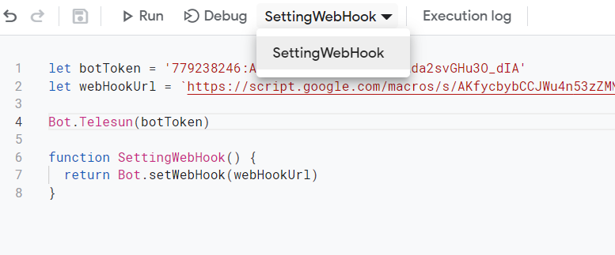
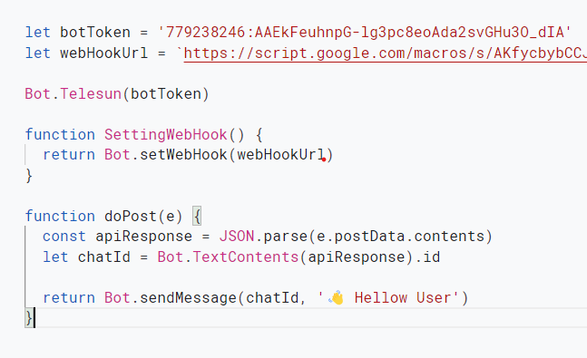

## Initial Deployment

---

> Steps :
>
> - click on `Deploy` button
> - click `New deployment`

---

## 

---

> - click on `setting` icon on the right side of `select type`
> - click on Web app

---

## 

## t

> - give anything or left empty to `new description`
> - leave `execute as` to the default
> - select <u>`Anyone`</u> from `who has access` drop down
> - finally click on `Deploy` button

---

## 

---

> when you are deploying for the `first time`, then it is required for you to authorize access so
>
> - click on `Authorize access` button

---

## 

---

> - choose one of your `Google account`

---

## 

---

> - click on `Advanced`

---

## 

---

> - click `Go to Learning The Library (unsafe)`

---

## 

---

> - click on `allow` button

---

## 

---

> - finally `copy` the web app url
> - click `Done`

---

## 

---

> - `paste` The copied `web app url`
> - `paste bot token` from bot father
> - add any fuction to `setWebHook`
> - `run` your function

---

## 

---

> - add `dopost` function
> - `Deploy` Again, but this time go for [Manage deployment](https://github.com/abdiu34567/telesn.js/blob/main/Deployments/Manage%20Deployment.md))

---

