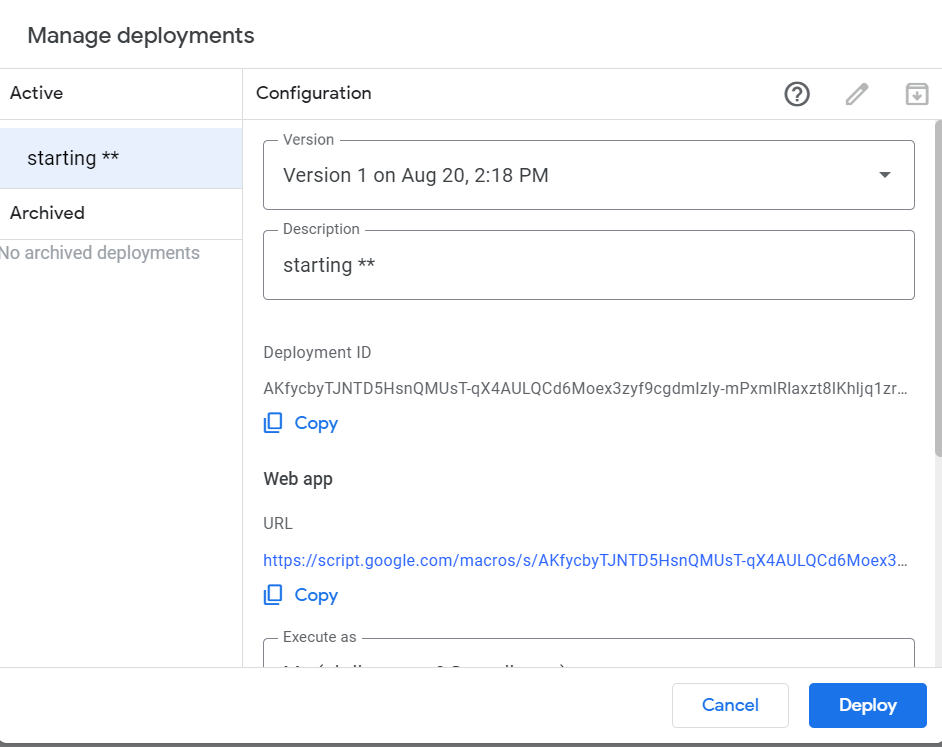
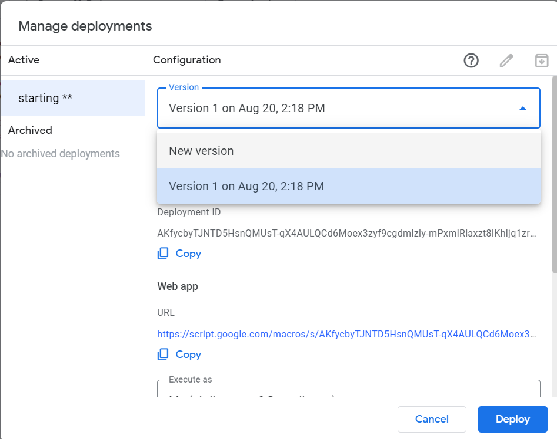
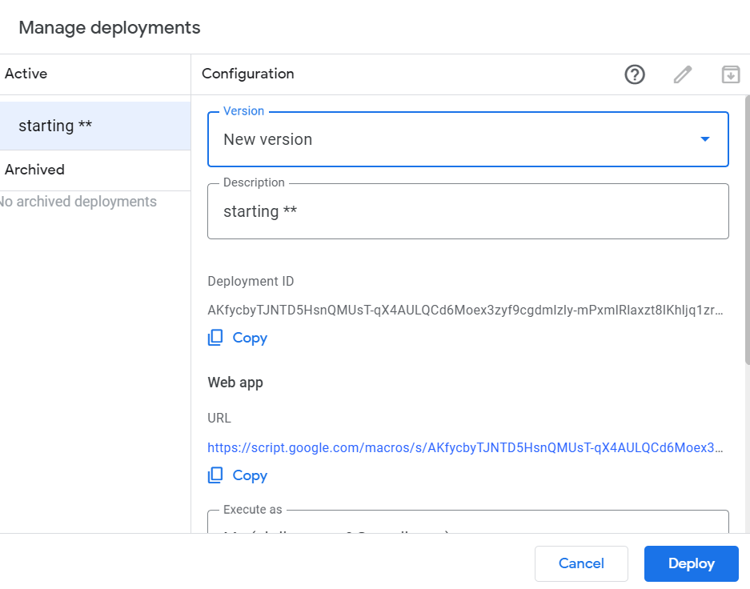
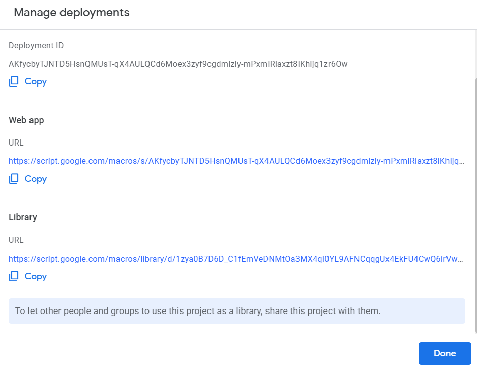

## Manage Deployments

---

> - click on `pencil (edit)` button

---

## 

---

> - from **version** drop down select `new version`

---

## 

---

> - check `new version` is selected
> - click `Deploy` button

---

## 

---

> - here don't need to copy anything just click on `Done` button

---

**You Did it**, Go and check Your Bot
