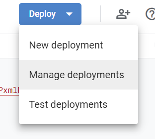

## Manage Deployments

Deploy with managed deployment every time after first time.

---

> - click on `Deploy -> Manage Deployment`

---

## 

> - click on `pencil (edit)` button

---

## 

---

> - from **version** drop down select `new version`

---

## 

---

> - check `new version` is selected
> - click `Deploy` button

---

## 

---

> - click on `Done` button, and you are done

---

### 🌟💪 `web app url is your webhook url` 🌟

` ** -- Manage Deployment Ends Here -- **`
