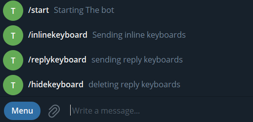

## Command Bot

> in this tutorial we are going to develop a bot send specific messages for the following commands we sent
>
> `Commands` are:
>
> - `/start`
> - `/inlinekeyboard`
> - `/replykeyboard`
> - `/hidekeyboard`



## Getting Started

- first we need `bot token` from bot father
- then `import` bot library, you can follow [here](https://github.com/abdiu34567/telesun.js/blob/main/ImportingLib.md)

```js
/**
 * Create function doPost()
 */

function doPost() {
  const token = "5862849341:AAHvKMVz2HGq5y9NBD4B4YAsEI0X9qE";
  Bot.Telesun(token);
}
```

```js
/**
 * continue adding codes to doPost() function
 * ❌ don't remove previous codes
 */

function doPost() {
  ...// don't remove previous codes

  //Executed when user sent /start command
  Bot.Command('start',(ctx)=>{
      ctx.reply('start command sent')
  })

  //Executed when user sent /inlinekeyboard command
  Bot.Command('inlinekeyboard',(ctx)=>{
      ctx.reply('inlinekeyboard command sent')
  })

  //Executed when user sent /replykeyboard command
  Bot.Command('replykeyboard',(ctx)=>{
      ctx.reply('replykeyboard command sent')
  })

  //Executed when user sent /hidekeyboard command
  Bot.Command('hidekeyboard',(ctx)=>{
      ctx.reply('hidekeyboard command sent)
  })
}
```

> Now, go and send any of the provided command to your bot and see the response

Let us continue, to send beautiful responses

```js
/**
 * updating our code
 * ❌ don't remove previous codes
 */

function doPost() {
  ...// don't remove previous codes

  //Executed when user sent /start command
  Bot.Command('start',(ctx)=>{
      //active user first name
      let User = ctx.chat().first_name

      // message to be sent
      let Message = `👤 Welcome ${User}\n\n` +
                    `🎗 Commands You Can Use :\n` +
                    `➖ /start\n` +
                    `➖ /inlinekeyboard\n` +
                    `➖ /replykeyboard\n` +
                    `➖ /hidekeyboard\n`

      //send message
      ctx.reply(Message)
  })

  //Executed when user sent /inlinekeyboard command
  Bot.Command('inlinekeyboard',(ctx)=>{
        //message to be sent
        let Message = `I Love Js, What about you ?`

        //inline keyboard to be sent
        let Keyboard = {
            inline_keyboard: [
                [
                    {
                        text: 'Js is Love, I mean Really',
                        callback_data: 'me2',
                    },
                ]
            ],
        }

        //sending to bot
       ctx.reply(Message, {reply_markup:Keyboard})
  })

  //Executed when user sent /replykeyboard command
  Bot.Command('replykeyboard',(ctx)=>{

    //messages to send
    let Message = `I Love Js, What about you`

    //reply keyboard to be send
    let replyKeyboard = {
        keyboard: [
        [{ text: '/start' }, { text: '/inlinekeyboard' }],
        [{ text: '/replykeyboard' }],
        [{ text: '/hidekeyboard' }],
        ],
        one_time_keyboard: true,
        resize_keyboard: true,
    }

    //sending to bot
    ctx.reply(Message, {reply_markup:replyKeyboard})
  })

  //Executed when user sent /hidekeyboard command
  Bot.Command('hidekeyboard',(ctx)=>{

        //message to send
        let Message = ` Reply Keyboard hidden`

        //removes the reply keyboards
        let removingReply = {
            remove_keyboard: true,
        }

       //sending to bot
       ctx.reply(Message, {reply_markup:removingReply})
  })
}
```

🌟💪 Wow, You have made it.

Now, Let Us `Deploy our code and make our bot live`

```js
/**
 * update your code as the following
*/

function doPost(e) {
  const token = "5862849341:AAHvKMVz2HGq5y9NBD4B4YAsEI0X9qE";
  Bot.Telesun(token,e);

  ...//don't remove other codes

```

- Then **[Deploy](https://github.com/abdiu34567/telesun.js/tree/main/Deployments)** your code

<br>

After, you have deployed your code and get your `webhook url` :

> - create a function called `settingWebhook` (can also be any name)

```js
/**
 * Create this function and run once, then you can delete it
 *
*/
fuction settingWebhook(){
  const token = "5862849341:AAHvKMVz2HGq5y9NBD4B4YAsEI0X9qE";
  Bot.Telesun(token);
  Bot.setWebHook()
}

```

🤖 -- Go & CHECK YOUR BOT -- 🤖
