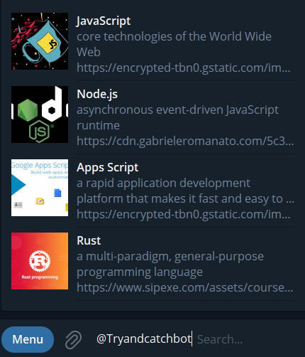

## Inline Query Bot

> In this tutorial we are going to develop a bot that can query inline datas by using `title` and `description` from json data
>
> 

## Getting Started

- first setup [Apps script project](https://github.com/abdiu34567/telesun.js/blob/main/Getting%20Started%20With%20App%20Script.md)
- then we need `bot token` from [BotFather](https://t.me/BotFather)
- then `import` bot library, you can follow [here](https://github.com/abdiu34567/telesun.js/blob/main/ImportingLib.md)
- in order for inline query to work for your bot follow :
  - `Bot Father -> /mybots -> (chose your bot) -> Bot Setting -> inline mode -> Turn inline mode on`

```js
/**
 * Create function doPost()
 */

function doPost() {
  const token = "5862849341:AvKMVz2HGq5y9NBD4B4YAsEI0X9qE";
  Bot.Telesun(token);
}
```

```js
/**
 * continue adding codes to doPost() function
 * ❌ don't remove previous codes
 */

function doPost() {
  ...// don't remove previous codes

  //on inline query
  Bot.Inline_query((ctx)=>{
    ctx.reply('this is inline query')
  })

}
```

> - Now, go and type anything on inline query
> - then, run your `doPost` function manually
> - and check your bot response

```js
/**
 * continue adding codes to doPost() function
 * ❌ don't remove previous codes
 */

function doPost() {
  ...// don't remove previous codes

//on inline query
Bot.Inline_query((ctx) => {
    let datas = [
      {
        title: "JavaScript",
        description: "core technologies of the World Wide Web",
        image:
          "https://encrypted-tbn0.gstatic.com/images?q=tbn:ANd9GcQp6J82nQKFRcR8SosVxPiNjsFKSa0kHlQE_Q&usqp=CAU",
      },
      {
        title: "Node.js",
        description: "asynchronous event-driven JavaScript runtime",
        image:
          "https://cdn.gabrieleromanato.com/5c37214980b3/uploads/2018/09/nodejs.jpg",
      },
      {
        title: "Apps Script",
        description:
          "a rapid application development platform that makes it fast and easy to create business applications that integrate with Google Workspace",
        image:
          "https://encrypted-tbn0.gstatic.com/images?q=tbn:ANd9GcTD1v8Chg0hK6RNiyHUMx4gcpVY_3izSNbiug&usqp=CAU",
      },
      {
        title: "Rust",
        description: "a multi-paradigm, general-purpose programming language",
        image: "https://www.sipexe.com/assets/courses/rust_programming.jpg",
      },
    ];


    let query = ctx.message().query.toLowerCase();
    let queryId = ctx.message().id;
    let inlineData = [];

    datas.filter((val, index) => {
      let title = val.title.toLowerCase();
      let description = val.description.toLowerCase();

      if (title.match(query) || description.match(query)){
        inlineData.push({
          type: "article",
          id: index,
          title: val.title,
          input_message_content: {
            message_text: val.description,
          },
          url: val.image,
          thumb_url: val.image,
          description: val.description,
        });
      }
    });

    ctx.answerInlineQuery({ inline_query_id: queryId, results: inlineData });
  })


}
```

> - Now, go and type anything like `rust`, `javascript`, `apps script`,on inline query
> - then, run your `doPost` function manually
> - and check your bot response

<br>

🌟💪 Wow, You have made it.

Now, Let Us `Deploy our code and make our bot live`

```js
/**
 * update your code as the following
 * add the parameter <e>
*/

function doPost(e) {
  const token = "5862849341:AAHvKMVz2HGq5y9NBD4B4YAsEI0X9qE";
  Bot.Telesun(token,e);

  ...//don't remove other codes

```

- Then **[Deploy](https://github.com/abdiu34567/telesun.js/tree/main/Deployments)** your code

<br>

After, you have deployed your code and get your `webhook url` :

> - create a function called `settingWebhook` (can also be any name)

```js
/**
 * Create this function and run once, then you can delete it
 *
 */
function settingWebhook() {
  const token = "5862849341:AAHvKz2HGq5y9NBD4B4YAsEI0X9qE";
  Bot.Telesun(token);

  //use your webhook url as url object parameter
  Bot.setWebHook({ url: "https://..." });
}
```

🤖 -- GO & CHECK YOUR BOT -- 🤖
