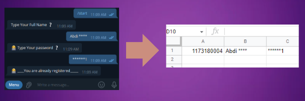

## Registration based on Google Sheet & Cache

> in this tutorial we are going to develop a bot which Register user based on name and password and saves on cache and Google sheet
>
> `Registration Requirements` are:
>
> - `Password`
> - `username`



### Getting Started

- first we need `bot token` from bot father
- then `import` bot library, you can follow [here](https://github.com/abdiu34567/telesun.js/blob/main/Getting%20Started%20With%20App%20Script.md)

```js
//<<code.gs>>

// find from bot father
let botToken = '123456789:AbCdfGhIJKlmNoQQRsTUVwxyZ'

Bot.Telesun(botToken)
```

### Setting Webhook

> To set webhook you need `webhook url`, and you can find it [here](https://github.com/abdiu34567/telesun.js/blob/main/Deployments/First%20Time%20Deployment.md)
>
> create and run function `SettingWebHook()`

```js
//<<code.gs>>

// find from bot father
let botToken = '123456789:AbCdfGhIJKlmNoQQRsTUVwxyZ'

let webhookUrl =
  'https://script.google.com/macros/s/AKfycbyTJNTD5HsnQMUsT-qX4AUQCd6Moex3zyf9cgdmlzly-mPxmlRlaxzt8lKhljq1zr6Ow/exec'

Bot.Telesun(botToken)

function SettingWebHook() {
  return Bot.setWebHook(webHookUrl)
}
```

### Add `doPost` function

> add `doPost()` function, and doPost function is where all of our code goes in

```js
//<<code.gs>>

let botToken = '123456789:AbCdfGhIJKlmNoQQRsTUVwxyZ'

Bot.Telesun(botToken)

function doPost(e) {
  const apiResponse = JSON.parse(e.postData.contents)
  if (apiResponse.message) return TextManager(apiResponse)

  return
}
```

> - create another `file` with any name but i will go with `Reg.gs`
> - create Spreadsheet and `copy Spreadsheet Id and Spreadsheet Name`, Follow [here](https://github.com/abdiu34567/telesun.js/blob/main/more/CreatSpreadsheet.md)

```js
//<<Reg.gs>>

//runs when user send any text message
function TextManager(apiResponse) {
  let chatId = Bot.TextContents(apiResponse).id

  let spreadsheetId = '1l5gUq-UF1zvwHxqhda--glhxq1vnVKfBj222E9SpwSg'
  let spreadsheetName = 'Sheet1'

  //check if user already registered
  let _db_ = SpreadsheetApp.openById(spreadsheetId).getSheetByName(spreadsheetName)
  let _row_ = _db_.createTextFinder(chatId).findNext()

  //if user found
  if (_row_)
    return Bot.sendMessage(chatId, '👩‍💻 ____You are already registered_____ ')

  //____ if user not found _________

  //if cache have some data (username | password)
  let cache = CacheService.getScriptCache()
  if (cache.get(chatId)) {
    let _toJson_ = JSON.parse(cache.get(chatId))
    let _state_ = _toJson_.state

    switch (_state_) {
      case 'username':
        saveUserNameToCache(apiResponse)
        return Bot.sendMessage(chatId, '👩‍💻 Type Your password ❔')

      case 'password':
        savePasswordToCache(apiResponse)
        saveToDb(apiResponse)
        return Bot.sendMessage(
          chatId,
          '👩‍💻 ____You are already registered_____ '
        )
    }
  }

  //_______if no data on cache______
  return askForUsername(chatId)
}

/*************************** */
function askForUsername(chatId) {
  Bot.sendMessage(chatId, `Type Your Full Name ❔`)

  //save state to cache by creating object
  let obj = { state: 'username' }
  let objToSave = JSON.stringify(obj) //must to save on cache

  let cache = CacheService.getScriptCache()
  return cache.put(chatId, objToSave)
}

/*************************** */
function saveUserNameToCache(apiResponse) {
  //user chat id
  let chatId = Bot.TextContents(apiResponse).id
  let userFullName = Bot.TextContents(apiResponse).text

  let cache = CacheService.getScriptCache()
  let obj = JSON.parse(cache.get(chatId))

  obj['username'] = userFullName //save full name to object
  obj['state'] = 'password' //updating state to password

  let objToSave = JSON.stringify(obj)
  return cache.put(chatId, objToSave) //update cache with full name
}

/*************************** */
function savePasswordToCache(apiResponse) {
  //user chat id
  let chatId = Bot.TextContents(apiResponse).id
  let password = Bot.TextContents(apiResponse).text

  let cache = CacheService.getScriptCache()
  let obj = JSON.parse(cache.get(chatId))
  obj['password'] = password //save password to object

  let objToSave = JSON.stringify(obj)
  return cache.put(chatId, objToSave) //update cache with full name
}

/*************************** */
function saveToDb(apiResponse) {
  let chatId = Bot.TextContents(apiResponse).id
  let cache = CacheService.getScriptCache()
  let userData = JSON.parse(cache.get(chatId))

  let username = userData.username
  let userPassword = userData.password

  //_________SavingToSheet_________
  let spreadsheetId = '1l5gUq-UF1zvwHxqhda--glhxq1vnVKfBj222E9SpwSg'
  let spreadsheetName = 'Sheet1'

  //check if user already registered
  let _db_ =
    SpreadsheetApp.openById(spreadsheetId).getSheetByName(spreadsheetName)
  _db_.appendRow([chatId, username, userPassword])
  return cache.remove(chatId) //finaly you can remove cache
}
```

Finaly delopy with [Managed Deploy](https://github.com/abdiu34567/telesun.js/blob/main/Deployments/Manage%20Deployment.md)

🌟💪 Check Your Bot
