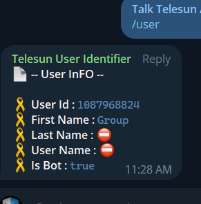

## Command Bot

> In this tutorial we are going to develop a sample `User identifier bot`

## Getting Started

- first setup [Apps script project](https://github.com/abdiu34567/telesun.js/blob/main/Getting%20Started%20With%20App%20Script.md)
- then we need `bot token` from [BotFather](https://t.me/BotFather)
- then `import` bot library, you can follow [here](https://github.com/abdiu34567/telesun.js/blob/main/ImportingLib.md)

Source code is : -- [Full Source code](https://script.google.com/home/projects/116d3_nxHpQHONHDVEZrUohD7s0Ur48XinkbGBu0Zc4yPLdWRXmN20TWb/edit) --
