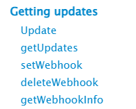

<header>


</header>

For More 💫 check <a href='https://core.telegram.org/bots/api#getting-updates'>Getting Updates</a>

To access methods :

```js
Bot.Update()
Bot.getUpdates()
Bot.setWebhook()
Bot. ....
.........
```
