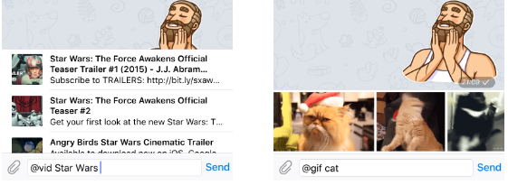

## Inline mode

The following methods and objects allow your bot to work in inline mode. Please see [Introduction to Inline bots](https://core.telegram.org/bots/inline) for more details.

To enable this option, send the /setinline command to @BotFather and provide the placeholder text that the user will see in the input field after typing your bot's name
