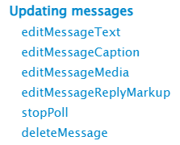

<header>


</header>

For More 💫 check [Updating Message](https://core.telegram.org/bots/api#updating-messages)

To access methods :

```js
Bot.editMessageText()
Bot.editMessageCaption()
Bot.editMessageMedia()
Bot. ....
.........
```
