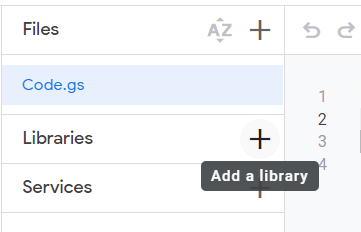
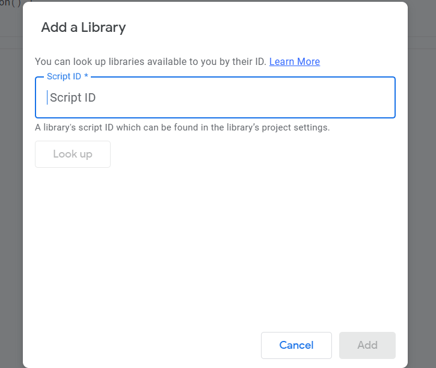
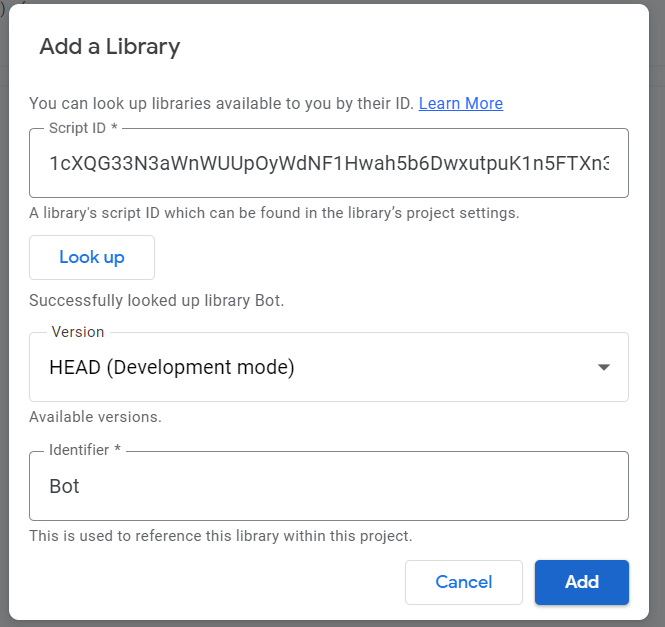

## Requirements

- Computer | Pc
- Google Account
- Sign In to your Google Drive

## Getting Started

> sign in to your Google Drive
>
> - click on `+ new` button

## 

---

> - click on `more`

---

## 

---

> - then you are on apps script editor page and more about Google apps script [here](https://www.benlcollins.com/apps-script/google-apps-script-beginner-guide/)

---


---

## Imporing Library

> - Click on The `+` button in the right side of `libraries`

---

## 

---

> **Script Id :**

```js
1cXQG33N3aWnWUUpOyWdNF1Hwah5b6DwxutpuK1n5FTXn3L7RAgNdars4
```

> - `copy` the script Id and paste on `Script Id` text input

---

## 

---

> - click `Look Up` button,
> - leave <u>varsion</u> name as `HEAD (Developing mode)`, you can also select `specific version`
> - leave <u>identifier</u> name as `Bot`
> - Click on `Add` button at the bottom

---



     🌟💪 **congratulation**, u are now imported the library
