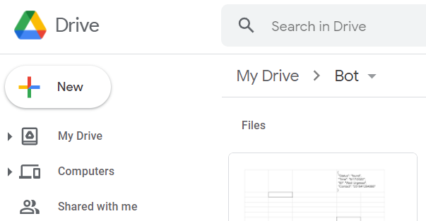
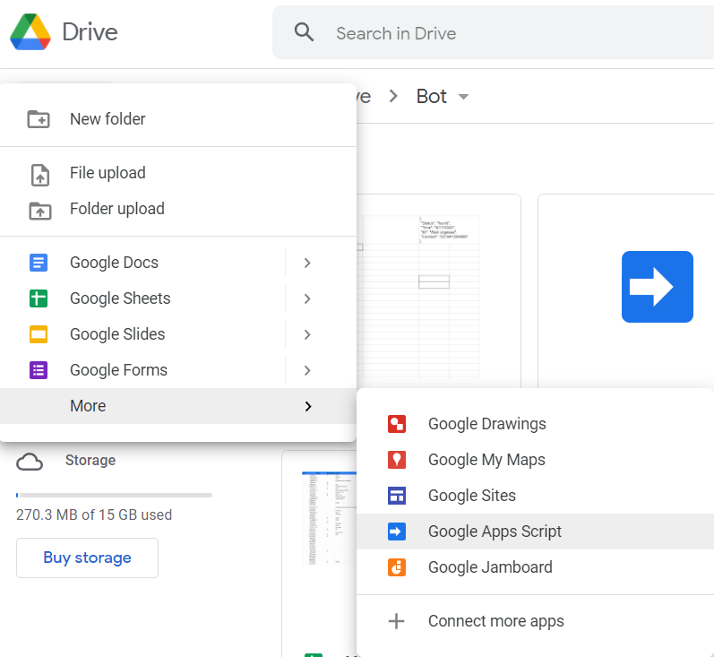
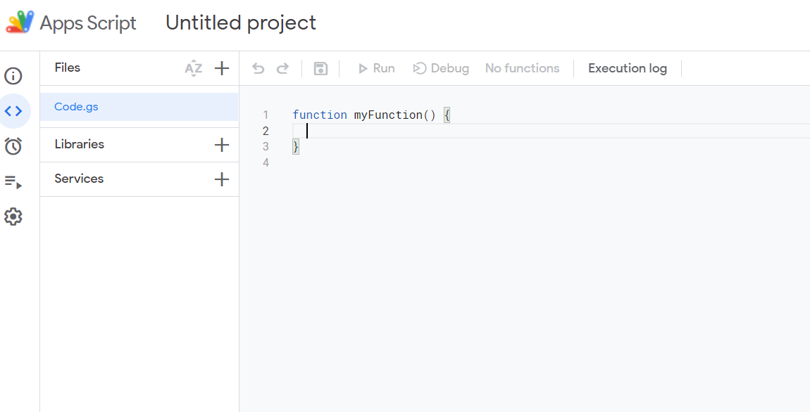

## Requirements

- Computer | Pc
- Google Account
- Sign In to your Google Drive

## Getting Started

> Sign in to your Google Drive
>
> - click on `+ new` button

## 

---

> - click on `more`

---

## 

---

> - then you are on apps script editor page and more about Google apps script [here](https://www.benlcollins.com/apps-script/google-apps-script-beginner-guide/)

---

---

> [Import Telesun Library](https://github.com/abdiu34567/telesun.js/blob/main/ImportingLib.md) to get started with Telegram bots
