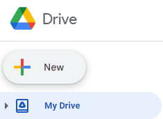
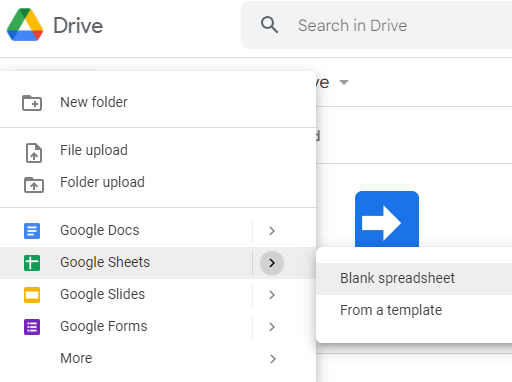
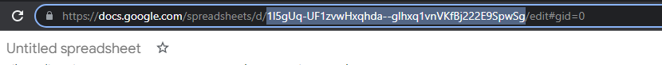
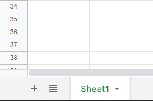

## Create Spreadsheet

- `sign in` to your google drive
- click `+ new` button

- click `Google Sheets` -> `Blank spreadsheet`

- `copy` the ` spreadsheet Id` as the following
- The spreadsheet Id is : `1l5gUq-UF1zvwHxqhda--glhxq1vnVfBj222E9SpwSg`

## 🌟 Sheet Name

- `sheet name` found on the bottom of page
- sheet name is `Sheet1` (can be edited or changed)

