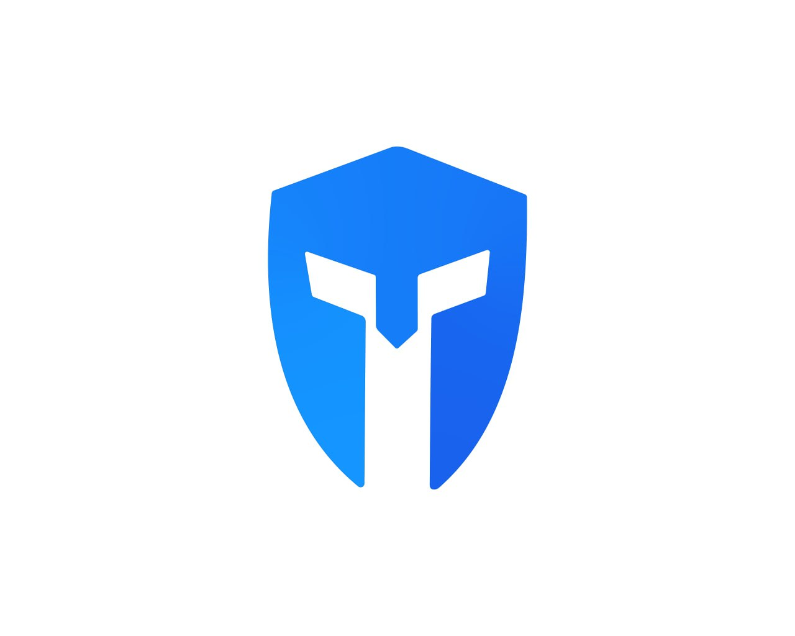

<h1 style="display: inline">Telesun.js</h1>

Modern Telegram Bot API framework for App Script

[](https://core.telegram.org/bots/api)

[](https://core.telegram.org/bots/api)
[](https://t.me/App_Script_Js)

</header>

## Introduction

A Telegram bot is a program that offers functions and automations that Telegram users can integrate in their chats, channels, or groups

Telesun is a library that makes it simple for you to develop your own Telegram bots using JavaScript and [Apps Script](https://developers.google.com/apps-script)

### Features

- Full [Telegram Bot API 7.0](https://core.telegram.org/bots/api) support
- Simpler 🌟
- easier working across Google products like `Youtube`, `Drive`, `Gmail...`
- per click `Deployment` on google cloud
- `Real-Time Database` (Google sheet) already integrated
- Develop `100+` of your Bots
- `Basic Javascript` is enough
- Fully `Typed` Support for `Autocompletion`
- `DevHook`
- `Long Polling` Support

---

## [Setting Up &amp; Getting Started With Apps Script](https://github.com/abdiu34567/telesun.js/wiki/Getting-Started)

---

<br>

### Example

once you `import library`, then you can create the following function and `go send any message to your bot` and **run** `WelcomeToTelesun` function

```js
// send message to your bot, then create the following function and run the function

function WelcomeToTelesun() {
  //pass your bot token
  const bot = new Bot.Telesun(<<botToken>>);

  //will executed always
  bot.Use((ctx) => ctx.reply("Hello World!"));

  //executed when <</start>> command sent to bot
  bot.Start((ctx)=> ctx.reply("This is start Command"))

  //when <hello> message sent
  bot.Hears('hello', (ctx)=> ctx.reply("This is hello message"))

  //when photo sent
  bot.Photo((ctx)=> ctx.reply("This is photo"))
}
```

For additional bot examples see [examples](https://github.com/abdiu34567/telesun.js/wiki/Example-Bots) folder

<br>

### Resources

- **[Telegram Group](https://t.me/telesunjs)**
- **[GitHub Discussions](https://github.com/abdiu34567/telesn.js/discussions)**
- **[Documentation](https://github.com/abdiu34567/telesun.js/wiki)**

<br>

## Getting started

<br>

### 💊 Telegram token

To use the Telegram Bot API, you first have to get a bot account by chatting with [BotFather](https://t.me/BotFather).

BotFather will give you a token, something like `123456789:AbCdfGhIJKlmNoQQRsTUVwxyZ`.

<br>

### 👩‍💻 Create Your First Registration bot

➖ The bot will register `username` and `password` by [long polling](https://github.com/abdiu34567/telesun.js/wiki/Long-Polling),`<br>`
➖ then finally we deploy the bot within just 2 clicks as `webhook` on google cloud

> - [Create apps script project](https://github.com/abdiu34567/telesun.js/wiki/Getting-Started)
> - [Import library](https://github.com/abdiu34567/telesun.js/wiki/Import-Telesun)

```js

/**
 * create function called doPost()
 * copy and paste the following code to your doPost()
 * go and type << /startreg >> command on your bot
 * go back to apps script and run dopost()
 * then check your bot
 *
 */

/**
 * pass your bot token
 * connecting the bot to Telesun Library
*/
const bot = new Bot.Telesun(<<botToken>>);

function doPost(){

 /**
  * when user send /startreg command
  */
  bot.Command('startreg',(ctx)=>{

    //ask user to send thier username
    ctx.reply("Please type Your username ?")

    //save stage that, next the bot is waiting for username
    ctx.setStage("username")
  })

}

```

```js
/**
 * Add the following function to the doPost(), but don't delete the previous code
 * go to bot and send your username
 * go to apps script and run doPost() again
 * then check your bot
 */
function doPost(){

  ......//❌ don't remove previos codes

  //if stage is already username
  bot.Stage('username', (ctx)=>{
      //accessing message text as username
      let _Username = ctx.message().text

      //saving to temporary session which lasts 10 minutes by default
      Bot.TSession.set('username', _Username)

      //ask user to send thier password
      ctx.reply("Please type Your password ?")

      //save stage as waiting for password
      ctx.setStage('password')
  })

}
```

```js
/**
 * Add the following function to the doPost(), but don't delete the previous code
 * go to bot and send your password
 * go to apps script and run doPost() again
 * then check your bot
 */
function doPost(){

  ...... //❌ don't remove previos codes

  ......//❌ don't remove previos codes

   //if stage is already password
  bot.Stage('password', (ctx)=>{

       //accessing username from temporary session
      let _Username = Bot.TSession.getValue('username')

      //send Message as user already finished the registration
      ctx.reply(`User Registered\n\n`+
     `UserName: ${_Username}`+
     `Password: ${ctx.message().text}`)
    }
  })


}


```

<br>

### 📡 Deploying Registration Bot

In Order to deploy your bot, first, check :

- your main file is `code.gs`
- your main function is `doPost(e)`

Then, we need to `set webhook` `<br>`

> you can get your `webhook url` after u have followed [Deployment](https://github.com/abdiu34567/telesun.js/wiki/Deployments) steps

```js
/**
 * Create this function and run once, then you can delete it
 */
function settingWebhook() {
  const token = "5862849341:AAHvKz2HGq5y9NBD4B4YAsEI0X9qE";

  //use your webhook url as url object parameter
  Bot.setWebHook(token, { url: "https://..." });
}
```

🌟💪 `Finally Check Your Bot`

<br>

## License

The Telesun library is open-source software released under the [MIT License](https://opensource.org/licenses/MIT).

[](https://opensource.org/licenses/MIT)

Copyright (c) 2022 Abdi Urgessa

Permission is hereby granted, free of charge, to any person obtaining a copy of this software and associated documentation files (the "Software"), to deal in the Software without restriction, including without limitation the rights to use, copy, modify, merge, publish, distribute, sublicense, and/or sell copies of the Software, and to permit persons to whom the Software is furnished to do so, subject to the following conditions:

The above copyright notice and this permission notice shall be included in all copies or substantial portions of the Software.

THE SOFTWARE IS PROVIDED "AS IS", WITHOUT WARRANTY OF ANY KIND, EXPRESS OR IMPLIED, INCLUDING BUT NOT LIMITED TO THE WARRANTIES OF MERCHANTABILITY, FITNESS FOR A PARTICULAR PURPOSE AND NONINFRINGEMENT. IN NO EVENT SHALL THE AUTHORS OR COPYRIGHT HOLDERS BE LIABLE FOR ANY CLAIM, DAMAGES OR OTHER LIABILITY, WHETHER IN AN ACTION OF CONTRACT, TORT OR OTHERWISE, ARISING FROM, OUT OF OR IN CONNECTION WITH THE SOFTWARE OR THE USE OR OTHER DEALINGS IN THE SOFTWARE.
