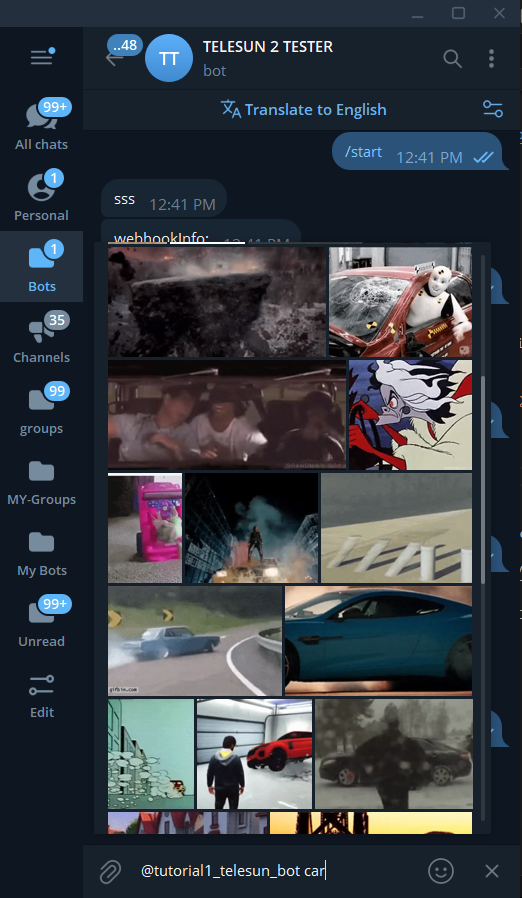
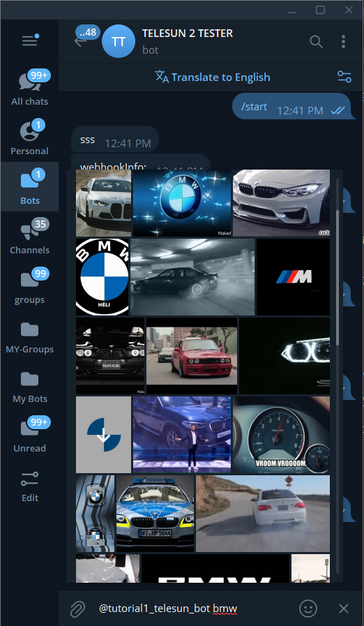

<h1 style="display: inline">Telesun.js</h1>

Modern Telegram Bot API framework for App Script

[](https://core.telegram.org/bots/api)

[](https://core.telegram.org/bots/api)
[](https://t.me/App_Script_Js)

</header>

## Introduction

A Telegram bot is a program that offers functions and automations that Telegram users can integrate in their chats, channels, or groups

Telesun is a library that makes it simple for you to develop your own Telegram bots using JavaScript and [Apps Script](https://developers.google.com/apps-script)

### Features

- Full [Telegram Bot API 7.0](https://core.telegram.org/bots/api) support
- Simpler 🌟
- easier working across Google products like `Youtube`, `Drive`, `Gmail...`
- per click `Deployment` on google cloud
- `Real-Time Database` (Google sheet) already integrated
- Develop `100+` of your Bots
- `Basic Javascript` is enough
- Fully `Typed` Support for `Autocompletion`
- `DevHook`
- `Long Polling` Support

---

## Setting Up &amp; Getting Started With Apps Script

[](https://www.youtube.com/watch?v=3XsWZIAZd6g)

<br>

---

## CREATE TELEGRAM BOT USING BOT FATHER

[](https://youtu.be/wu-x8Q3-6a4)

<br>

---

## ADD TELESUN LIBRARY

[](https://youtu.be/RUf4DWm8ihM)

<br>

---

<br>

### Example

```js
function initializeTelesunBot() {
  // Initialize your bot with the provided token.
  const telesun = new Telesun.connectBot("<your-bot-token>");

  // Default handler for any incoming messages.
  telesun.use((ctx) => ctx.reply("Welcome to our service!"));

  // Handler for the `/start` command.
  telesun.start((ctx) => {
    ctx.reply("Welcome! Ready to explore?");
  });

  // Specific handler for text messages containing "hello".
  telesun.hears("hello", (ctx) =>
    ctx.reply("Hello there! How can I assist you today?")
  );

  // Handler for incoming photos.
  telesun.photo((ctx) => ctx.replyWithPhoto({ photo: "<photo-url|photo-id>" }));

  // Inline query handler.
  telesun.on("inline_query", (ctx) => {
    ctx.answerInlineQuery({
      results: [], // Specify the results array
      inline_query_id: ctx.inlineQuery.id, // Correctly reference inline_query_id
    });
  });
}
```

```js
function demonstrateAdvancedFeatures() {
  // Advanced setup with spreadsheet connection and memory services.
  const telesun = new Telesun.connectBot("<your-bot-token>")
    .connectToSpreadSheet("<your-spreadsheet-id>")
    .temporaryMemory(CacheService)
    .permanentMemory(PropertiesService);

  telesun.on("message", (ctx) => {
    // Handling message updates.
    const update = ctx.update.message; // Correct method to access the message update.

    // Clearing a specified sheet.
    ctx.sheet("Sheet1").clear();

    // Preparing for the next interaction stage.
    ctx.setStage("message");

    // Sending an email notification.
    ctx.sendEmail(
      "email@example.com", // Use a placeholder or generic email for examples.
      "Telesun V2-beta Released",
      "We're excited to announce the release of Telesun V2-beta. Join us in enhancing and refining the documentation."
    );

    // Setting a temporary session value (with a default lifespan of 10 minutes).
    ctx.setTSessionValue("key", "value");
  });
}
```

For additional bot examples see [examples](https://github.com/abdiu34567/telesun.js/wiki/Example-Bots) folder

<br>

### Resources

- **[Telegram Group](https://t.me/telesunjs)**
- **[GitHub Discussions](https://github.com/abdiu34567/telesn.js/discussions)**
- **[Documentation](https://github.com/abdiu34567/telesun.js/wiki)**

<br>

## Getting started

<br>

### 💊 Telegram token

To use the Telegram Bot API, you first have to get a bot account by chatting with [BotFather](https://t.me/BotFather).

BotFather will give you a token, something like `123456789:AbCdfGhIJKlmNoQQRsTUVwxyZ`.

<br>

### 🚀 Launch Your First Gif Inline Query Bot

Welcome to this exciting tutorial where we'll embark on the journey of creating a `Gif Inline Query` bot. This isn't just any bot; it's your gateway to integrating the dynamic and fun world of GIFs right into any chat. Picture this: users type, scroll, and BAM! - an endless stream of GIFs at their fingertips. And guess what? We're tapping into the vast universe of [GIPHY API](https://developers.giphy.com/docs/api/endpoint/) to power our search for those perfect GIFs.

<div style="display: flex;">
    
    
</div>

<br>

Features to Get Excited About:

- **Instant Gratification:** Just by mentioning the bot's username in the text area, you'll unleash a world of trending GIFs, loading automatically to greet the user.
- **Search on the Fly:** As users start typing their queries, our bot springs into action, fetching GIFs that match their search terms in real time.
- **Infinite Scrolling Magic:** As users delve deeper, scrolling through the GIFs, more and more GIFs magically appear, ensuring the fun never ends.

💪 Ready to dive in? I sure am. Let's get this show on the road and create a bot that brings smiles, laughs, and a whole lot of GIFs to any conversation.

### Setup Guide

Get Started

> - **Create an App Script Project:** [Watch Tutorial](https://www.youtube.com/watch?v=3XsWZIAZd6g)
> - **Import Telesun Libraries:** [Learn How](https://youtu.be/RUf4DWm8ihM)
> - **Craft Your Bot:** [Begin Here](https://youtu.be/wu-x8Q3-6a4)

<br>

Activate Inline Queries with Bot Father

> 1. Type `/mybots` to Bot Father.
> 2. Choose your bot.
> 3. Navigate to `Bot Settings` > `Inline Mode`.
> 4. Enable it.

<br>

#### Step 1: create your first function

create a function, name it anything you like, but for production purposes, the function name must be `doPost`.

```js
function doPost() {
  // Bot initialization with your token.
  const telesun = new Telesun.connectBot("<your-bot-token>");

  // handles inline_query updates.
  telesun
    .on("inline_query", (ctx) => {
      // Your code here.
    })
    .longPolling(); // Maintains open connection for new updates.
}
```

#### Step 2: Integrate GIPHY API

Now, let's secure our API key from [GIPHY API](https://developers.giphy.com/dashboard/) to access `trending` and `search` endpoints. Below is how we fetch GIFs:

```js
// Fetch GIFs from Giphy, tailored by your query.
function fetchGifs(
  apiKey,
  query,
  offset = 0,
  limit = 20,
  rating = "g",
  lang = "en"
) {
  let baseUrl = "https://api.giphy.com/v1/gifs"; // Base endpoint.
  const queryParams = `api_key=${apiKey}&limit=${limit}&offset=${offset}&rating=${rating}&lang=${lang}`;

  // Adjust endpoint based on query presence.
  baseUrl += query
    ? `/search?q=${encodeURIComponent(query)}&${queryParams}`
    : `/trending?${queryParams}`;

  const response = UrlFetchApp.fetch(baseUrl); // Fetch the data.
  const json = JSON.parse(response.getContentText()); // Parse the JSON.
  return json.data; // Return the GIFs.
}
```

#### Step 3: Sending Inline Query Results

To respond to inline queries, our bot employs the `answerInlineQuery` method. This essential method requires parameters such as an `array of results` and the `inline_query_id`.

Each `result` object must include crucial details like `type`, `id`, `gif_url`, and `thumbnail_url`.

```js
// Function to format GIFs for Telegram inline query response
function formatGifsForInlineQuery(gifs) {
  return gifs.map((gif) => ({
    type: "gif",
    id: gif.id,
    gif_url: gif.images.fixed_height.url,
    thumbnail_url: gif.images.fixed_height_small_still.url,
  }));
}
```

#### Step 4: Answering the Inline Query

```js
function doPost() {
  // Initialize the bot with your token.
  const telesun = new Telesun.connectBot("<your-bot-token>");

  // Handle inline_query updates.
  telesun
    .on("inline_query", (ctx) => {
      const inline_query = ctx.inlineQueryUpdate();
      const query = inline_query.query;
      const offset = parseInt(inline_query.offset, 10) || 0; // Parse the offset, defaulting to 0 if absent.
      const apiKey = "<your-giphy-api-key>";
      const limit = 20; // Determine the number of results to fetch.

      // Fetch GIFs based on the user's query and the current offset.
      const gifs = fetchGifs(apiKey, query, offset, limit);
      const results = formatGifsForInlineQuery(gifs);

      // Reply to the inline query with the fetched results and set the next offset.
      const nextOffset = offset + limit;

      ctx.answerInlineQuery({
        results,
        inline_query_id: inline_query.id,
        next_offset: nextOffset.toString(),
      });
    })
    .longPolling(); // Maintain the connection for incoming updates.
}
```

#### Step 5: Making Our Code Production-Ready

Integrate the parameter `e` into both `doPost(e)` and `handleWebhook(e)` to elevate our code for production.

```js
function doPost(e) {
  // Initialize the bot with your token.
  const telesun = new Telesun.connectBot("<your-bot-token>");

  // Handle inline_query updates.
  telesun
    .on("inline_query", (ctx) => {
      const inline_query = ctx.inlineQueryUpdate();
      const query = inline_query.query;
      const offset = parseInt(inline_query.offset, 10) || 0; // Parse the offset, defaulting to 0 if absent.
      const apiKey = "<your-giphy-api-key>";
      const limit = 20; // Determine the number of results to fetch.

      // Fetch GIFs based on the user's query and the current offset.
      const gifs = fetchGifs(apiKey, query, offset, limit);
      const results = formatGifsForInlineQuery(gifs);

      // Reply to the inline query with the fetched results and set the next offset.
      const nextOffset = offset + limit;

      ctx.answerInlineQuery({
        results,
        inline_query_id: inline_query.id,
        next_offset: nextOffset.toString(),
      });
    })
    .handleWebhook(e);
}
```

Our GIF inline query bot is now primed for launch. The upcoming section will guide you through `deploying` your project to the world.

<br>

### 📡 Deploying Your Gif Inline Query Bot

Ready to bring your bot to life? Just follow these simple steps:

> - Ensure your primary script is named `code.gs`.
> - Verify that `doPost(e)` is set as your main function.

Next, deploy your code to obtain the `Web App URL`. Not sure how? Watch this quick guide:

> [](https://youtu.be/55Lb_COLR5U)

After deploying your code and securing your `Web App URL`, execute the following:

```js
function SetWebhook() {
  new Telesun.connectBot("<your-bot-token>").setWebhook({
    url: "<your-web-app-url>",
  });
}
```

🌠 That's it! Dive in and enjoy interacting with your bot. 🎉

<br>

## License

The Telesun library is open-source software released under the [MIT License](https://opensource.org/licenses/MIT).

[](https://opensource.org/licenses/MIT)

Copyright (c) 2022 Abdi Urgessa

Permission is hereby granted, free of charge, to any person obtaining a copy of this software and associated documentation files (the "Software"), to deal in the Software without restriction, including without limitation the rights to use, copy, modify, merge, publish, distribute, sublicense, and/or sell copies of the Software, and to permit persons to whom the Software is furnished to do so, subject to the following conditions:

The above copyright notice and this permission notice shall be included in all copies or substantial portions of the Software.

THE SOFTWARE IS PROVIDED "AS IS", WITHOUT WARRANTY OF ANY KIND, EXPRESS OR IMPLIED, INCLUDING BUT NOT LIMITED TO THE WARRANTIES OF MERCHANTABILITY, FITNESS FOR A PARTICULAR PURPOSE AND NONINFRINGEMENT. IN NO EVENT SHALL THE AUTHORS OR COPYRIGHT HOLDERS BE LIABLE FOR ANY CLAIM, DAMAGES OR OTHER LIABILITY, WHETHER IN AN ACTION OF CONTRACT, TORT OR OTHERWISE, ARISING FROM, OUT OF OR IN CONNECTION WITH THE SOFTWARE OR THE USE OR OTHER DEALINGS IN THE SOFTWARE.
